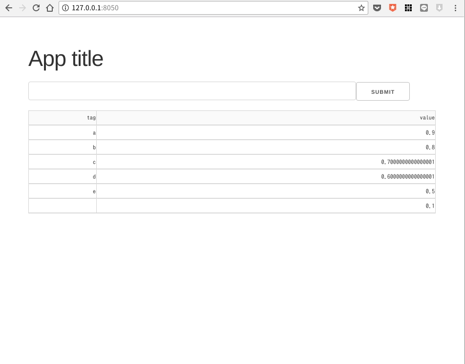

# dash_sample
plotly dash のdata_tableを使うためのサンプル

## 必要モジュール

```pip install dash dash_table dash_core_components dash_html_components pandas

## アプリケーション表示リンク
[127.0.0.1:8050](127.0.0.1:8050)

## 結果

